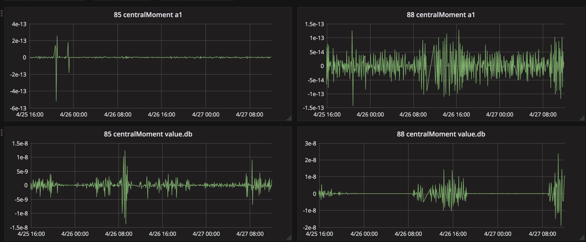

# vagrant_moloch

* http://molo.ch/#downloads
* https://www.vagrantup.com/downloads.html

## http://molo.ch/#home

>  Moloch is a large scale, open source, full packet capturing, indexing, and database system.
> Moloch augments your current security infrastructure by storing and indexing network traffic in standard PCAP format, while also providing fast indexed access. Moloch is not meant to replace Intrusion Detection Systems (IDS), instead it provides more visibility. Moloch is built with an intuitive UI/UX which reduces the analysis time of suspected incidents.

## stats

Retrieve the unique data with *counts* for a fields, calculate on counts vector: **min, max, size, Sigma, .. kurtosisPop** and send to *influxdb*.

* see https://github.com/hillar/vagrant_moloch/tree/master/statslines

## docker

...
