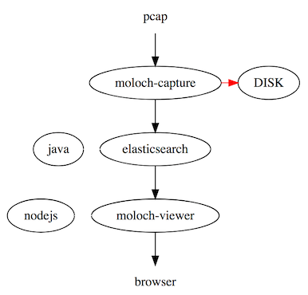

# storing and indexing network traffic in standard PCAP format, while also providing fast indexed access.



## storing  network traffic in standard PCAP

* see https://github.com/aol/moloch/wiki/FAQ#Capture

## indexing network traffic

* see https://github.com/aol/moloch/wiki/FAQ#Elasticsearch

## fast indexed access

* https://github.com/aol/moloch/wiki/FAQ#Viewer

----

## 1. install java

* https://docs.oracle.com/javase/8/docs/technotes/guides/install/install_overview.html

```bash
add-apt-repository ppa:webupd8team/java
apt-get update
apt-get -y install oracle-java8-installer
```
## 2. install elasticsearch

* https://www.elastic.co/guide/en/elasticsearch/reference/current/_installation.html

```bash
ELASTICSEARCH="elasticsearch-5.6.2.deb"
wget https://artifacts.elastic.co/downloads/elasticsearch/$ELASTICSEARCH
dpkg -i $ELASTICSEARCH
systemctl enable elasticsearch
systemctl start elasticsearch

```

## 3. install nodejs

* https://nodejs.org/en/download/package-manager/

```bash
curl -sL https://deb.nodesource.com/setup_6.x | sudo -E bash -
sudo apt-get install -y nodejs

```

## 4. install depes

```bash
apt-get -y install libwww-perl libjson-perl libyaml-dev
```

## 5. install moloch-nightly

```bash
wget -q -4 https://files.molo.ch/builds/ubuntu-16.04/moloch-nightly_amd64.deb
dpkg -i moloch-nightly_amd64.deb

/data/moloch-nightly/bin/Configure
/data/moloch-nightly/db/db.pl http://localhost:9200 init
/data/moloch-nightly/bin/moloch_add_user.sh admin "Admin User" <password> --admin

systemctl start molochviewer.service

```

## read pcap

```bash
cd /data/moloch-nightly/bin/
./moloch-capture -c ../etc/config.ini -r 2017-09-19-traffic-analysis-exercise.pcap

```
