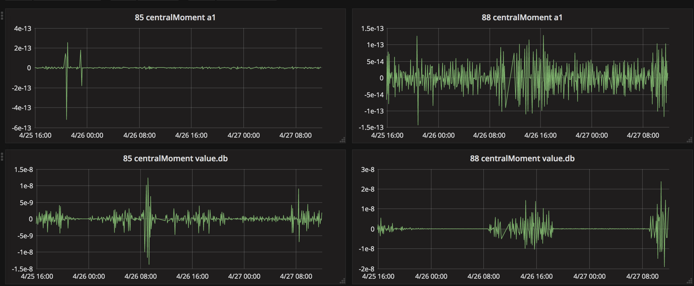

## Descriptive Statistics

Retrieve the unique data with *counts* for a fields (a1,p2,sl,pa,db,...), calculate on counts vector:
* min
* max
* size
* Sigma, PI
* mean, median, centralMoment
* variance, variancePop, stableVariance, stableVariancePop
* stdDev, stdDevPop, stableStdDev, stableStdDevPop
* skewness, skewnessPop
* kurtosis, kurtosisPop

and send to *influxdb*.

> You do not need to know, what kurtosis und skewness do. You just need to see that collecting Descriptive Statistics Timelines give you a CHANGE.

see
* https://github.com/aol/moloch/wiki/API#uniquetxt
* https://github.com/aol/moloch/blob/39a2771f72544ee0050a06c9e624954301753849/viewer/viewer.js#L3651
* https://github.com/hillar/atoll.js



### example

```bash
# create influxdb database
curl -i -XPOST http://192.168.10.12:8086/query --data-urlencode "q=CREATE DATABASE molouniqs"

# download scripts
mkdir /data/moloch-nightly/stats
cd /data/moloch-nightly/stats
wget -q https://raw.githubusercontent.com/hillar/atoll.js/master/lib/atoll.js
wget -q https://raw.githubusercontent.com/hillar/vagrant_moloch/master/stats/vectorstats.js
wget -q https://raw.githubusercontent.com/hillar/vagrant_moloch/master/stats/moloUniq2influx.bash

# edit moloUniq2influx.bash and run it

bash moloUniq2influx.bash

# create grafana datasource
curl -s -XPOST --user admin:admin 192.168.10.12:3000/api/datasources -H "Content-Type: application/json" -d '{
    "name": "moloch",
    "type": "influxdb",
    "access": "proxy",
    "url": "http://localhost:8086",
    "database": "molouniqs",
    "isDefault": true
}'
# create grafana dashboards
wget -q https://raw.githubusercontent.com/hillar/vagrant_moloch/master/stats/dashboard-grahpperfieldandfunc.json
curl -uadmin:admin 'http://192.168.10.12:3000/api/dashboards/import' \
-H 'Content-Type: application/json;charset=UTF-8' \
--data-binary @dashboard-grahpperfieldandfunc.json

wget -q https://raw.githubusercontent.com/hillar/vagrant_moloch/master/stats/dashboard-fieldsonsamegraf.json
curl -uadmin:admin 'http://192.168.10.12:3000/api/dashboards/import' \
-H 'Content-Type: application/json;charset=UTF-8' \
--data-binary @dashboard-fieldsonsamegraf.json

# wait for some window time then open grafana
```

----

* Skewness is the extent to which the data are not symmetrical.
* Kurtosis is extent to which the data are peaked.
* Standard deviation is measure of dispersion.
* Variance is equal to the standard deviation squared.
* Sigma (Σ) means summation.
* PI means product of.

----

describing is done with one of:
 * bash : [descriptivestats.bash](descriptivestats.bash)
 * javascript (nodejs) : [descriptivestats.js](descriptivestats.js)
 * R : descriptivestats.R (TODO)
